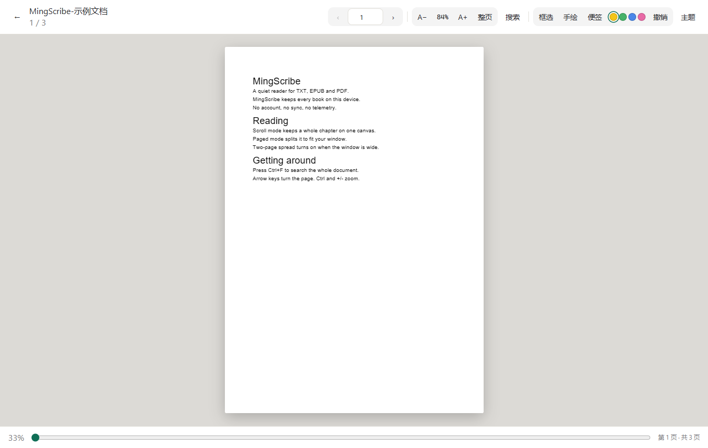
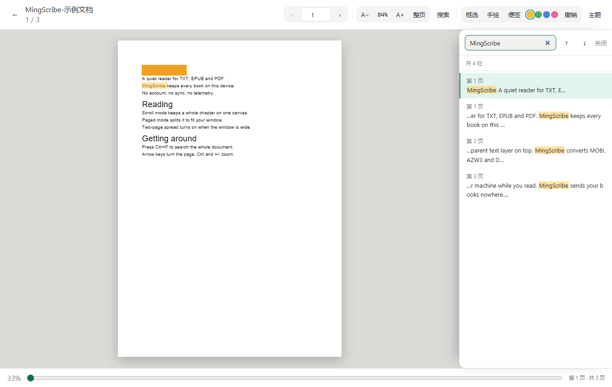
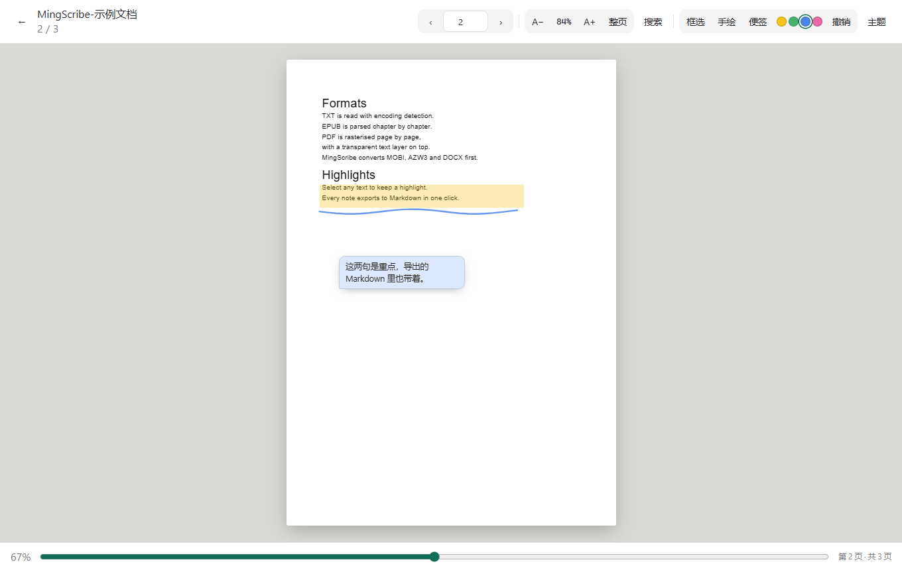

# MingScribe

[](https://github.com/0xm1ng/MingScribe/actions/workflows/ci.yml)
[](https://github.com/0xm1ng/MingScribe/releases/latest)
[](LICENSE)
[](#运行测试)
[](#许可)

一个**纯前端、零依赖**的电子书阅读器，外加一个可选的**桌面壳**。

- **网页版**：双击 `index.html` 就能用，不需要装任何东西、不需要起服务器、不需要联网。读 TXT 与 EPUB。
- **桌面版**：套了一层 [Tauri](https://tauri.app/) 壳，额外做两件事：接上 [Calibre](https://calibre-ebook.com/) 的 `ebook-convert`，于是 MOBI / AZW3 / DOCX / FB2 / RTF / ODT 等格式也能读（先转成 EPUB 再走同一套流程）；内置 [pdf.js](https://mozilla.github.io/pdf.js/)，于是 **PDF 也能看**（固定版式按页渲染，与原版版面一致）。

功能：滚动与真分页（一屏一页、可双页对开）、目录、全文搜索、四种颜色划线与批注、导出 Markdown（可直接进 Obsidian）、阅读进度记忆、**按书记忆排版**（字号 / 行距 / 页宽）、日间/夜间主题；PDF 另有独立阅读视图（翻页 / 跳页 / 缩放 / 适应页宽与整页 / 全文搜索 / **框选高亮 · 手绘 · 便签**）。

技术上的两个关键取舍：

1. **所有格式先转成同一个中间结构**（章节列表 + 纯文本），显示层只认它。所以加 EPUB、加桌面版多格式，都没有改动进度、搜索、划线、导出任何一行。
2. **阅读位置一律用「第几章 + 章内第几个字」记录，不用页码。** 因此改字号、改窗口大小、切滚动/分页，位置都不会漂。

## 界面

截图里的书都是公开授权的开源读物（《Web安全学习笔记》《Hello-CTF》《OWASP 测试指南》与古腾堡版《山海經》）。

**书架** —— 一本书一张卡片，TXT 与 EPUB 都能进书架，下次点一下直接续读。

**封面是「画」出来的，不是挑个颜色再摆一个字。** 配色由书名散列得到，但**不是**直接拿哈希当色相：那样必然有一部分书名落进土黄 / 橄榄黄绿那段「怎么调都显脏」的区间，所以改成在一组精选色相锚点里取（18 个锚点 × 5 档明度）。封面上再叠一层**按书的类型挑的图案纹理**——技术书是电路折线 / 方格网，古籍是书脊竖线 / 人字纹，科学书是同心圆 / 点阵，文学是水波 / 斜纹，认不出类型的走通用图案池；主视觉是**排版过的书名**（衬线体，字号按字数分档，长书名自动缩），再加格式角标与左侧书脊暗条补足「像一本书」的细节。

**卡片能翻面。** 正面只放封面和信息，鼠标悬停（或键盘 `Tab` 聚焦）就转 180° 到背面：那里是完整详情（章节 / 上次打开 / 格式与缓存状态）加「继续阅读 / 删除」。触屏设备没有悬停概念，卡片不翻面，操作按钮直接留在正面；系统开了「减少动态效果」时不做 3D 旋转，改成直接换面——**不会因为关掉动画就没法删书**。

**导航栏与书架都是通栏的**，两侧不留白；书架标题行与下方卡片网格之间留出足够呼吸感，底部四张特性卡各自是一个真链接，点开能到对应的文档章节或 Releases 页。


**滚动模式**（默认）—— 正文按「页宽」档位居中，长书滚动也不卡：


**分页模式** —— 一屏一页、整页替换，底部显示页码：


**双页对开** —— 宽屏自动开启，窄屏自动回到单页，也能手动切：


**目录**与**全文搜索** —— 跨章节检索、正文高亮、`Enter` 在命中之间跳：


**四色划线与批注** —— 右侧面板列出全部划线，点一条跳回正文；也可导出 Markdown：


**夜间主题** —— 与日间共用同一套锚点，切换不影响阅读位置：


**PDF 阅读视图**（桌面版）—— 固定版式按页渲染，原版版面、公式、图表、扫描件都在：



**PDF 全文搜索与划选** —— 页面上盖一层透明文字，可以像网页一样划选复制；`Ctrl+F` 搜全书，
命中在纸面上标黄、当前那一处描成橙色，右侧列出每一条并直接跳页：



**PDF 批注** —— 框选高亮、手绘、便签三种。锚点是「页码 + 页面内相对位置（0~1 比例）」，
所以改缩放、切「适应宽度 / 整页」、拉窗口大小都不会漂；**扫描件（整页就一张图）一样能批注**：



## 快速开始

### 网页版（读 TXT / EPUB）

双击 `index.html` 即可。想跑测试：

```bash
npm test
```

### 桌面版（多格式）

不想自己编译 Rust？直接到 [Releases](https://github.com/0xm1ng/MingScribe/releases/latest) 下载 Windows x64 安装包：

| 文件 | 体积 | 说明 |
|---|---|---|
| `MingScribe_0.3.0_x64-setup.exe` | 3.70 MB | 常规安装程序，推荐 |
| `MingScribe_0.3.0_x64_en-US.msi` | 4.61 MB | 适合企业批量部署 |

> 体积比 v0.2.0（1.84 / 2.76 MB）大了约一倍，因为内置了 pdf.js 及其 CID 映射（169 个 `cmaps`）与标准字体（16 个 `standard_fonts`）——**少了它们中文 PDF 会整页缺字**。这些资源只在打开 PDF 时按需加载，不影响启动速度。

> 安装包**未做代码签名**，首次运行时 Windows SmartScreen 会提示「已保护你的电脑」——点「更多信息」→「仍要运行」即可。

要自己编译，则需要 Rust 与 Calibre，详见下方「桌面版与多格式支持」一节：

```bash
npm install
npm run tauri:dev
```

## 怎么用

<a id="annotations"></a>

网页版操作方式：

| 操作 | 方式 |
|---|---|
| 打开书 | 点书架上的「＋ 添加图书」卡片（空书架时是中间那颗按钮） |
| 滚动 / 分页模式 | 顶部「滚动」/「分页」按钮切换（分页 = 固定一屏一页） |
| 上一章 / 下一章 | 底部按钮；滚动模式下键盘 `←` `→` |
| 翻一页 | 分页模式下键盘 `←` `→`、`PageUp` / `PageDown` / 空格，或点页面左右两侧 |
| 跳到本章开头 / 结尾 | `Home` / `End`（分页模式为本章首页 / 末页） |
| 目录 | 顶部「目录」按钮，`Esc` 关闭 |
| 字号 | 顶部 `Aa` → `A−` / `A+`（16 ~ 26px 共 6 档） |
| 行距 | 顶部 `Aa` → `−` / `＋`（1.55 ~ 2.3 共 6 档） |
| 页宽 | 顶部 `Aa` → `−` / `＋`（共 6 档；滚动与分页模式都生效，双页对开下隐藏，每页宽由容器自动决定） |
| 本书排版复位 | 顶部 `Aa` → 「恢复默认」——把**当前这本书**的字号 / 行距 / 页宽恢复成全局设置 |
| 日间 / 夜间 | 顶部「主题」按钮（在书里是顶栏右侧，在书架是右上角） |
| 检查更新 / 关于 / 帮助 | 书架右上角「☰」菜单 |
| 全文搜索 | 顶部「搜索」按钮，或 `Ctrl` / `Cmd + F` |
| 搜索结果间跳转 | `Enter` 下一处、`Shift + Enter` 上一处 |
| 快进 / 快退 | 拖动底部进度条；进度条聚焦时 `←` `→` 每次 1% |
| 划线 | 选中正文一段文字 → 浮出的工具条上点颜色（黄 / 绿 / 蓝 / 粉） |
| 写批注 | 选中文字后点「批注」，或点击已有划线；`Ctrl + Enter` 保存 |
| 我的划线 | 顶部「笔记」按钮，或 `Ctrl` / `Cmd + M`；点列表项跳回正文 |
| 导出笔记 | 打开「笔记」面板 → 点「导出」，得到 `<书名>-笔记.md` |
| 关闭面板 | 点面板以外的任意位置即可（目录 / 搜索 / 笔记 / 批注弹层都一样）；`Esc` 也可 |

**打开 PDF**（桌面版）会切到独立的阅读视图，操作方式：

| 操作 | 方式 |
|---|---|
| 翻页 | 顶部 `‹` `›`、键盘 `←` `→` / `PageUp` / `PageDown` / 空格 |
| 跳到指定页 | 顶部页码输入框，回车即跳 |
| 任意翻页 | 拖动底部滑块 |
| 缩放 | 顶部 `A−` / `A+`（10 档，0.5× ~ 3×）；`+` / `-` 键同样生效 |
| 适应宽度 / 整页 | 顶部「适应宽度 / 整页」按钮来回切；手动缩放过会显示「自定义」 |
| 划选 / 复制文字 | 直接用鼠标在页面上拖选，`Ctrl + C` 可复制（页面盖了一层透明文字） |
| 全文搜索 | 顶部「搜索」按钮，或 `Ctrl` / `Cmd + F`；命中在纸面上标黄，当前那处描橙 |
| 搜索结果间跳转 | `Enter` 下一处、`Shift + Enter` 上一处，或点右侧列表里的任意一条直接跳页 |
| 关闭搜索面板 | 面板上的「关闭」，或 `Esc`（`Esc` 先收面板，再按一次才退出 PDF） |
| 框选高亮 | 点顶部「框选」→ 在页面上按住拖一个方块；点一下已有的批注就删掉它 |
| 手绘 | 点顶部「手绘」→ 按住拖出笔迹（画下划线、随手圈画都行） |
| 便签 | 点顶部「便签」→ 在页面上点一下贴一张，随即可以打字；写完点别处即保存，`Ctrl + Enter` 收起 |
| 换批注颜色 | 顶部四个色点，黄 / 绿 / 蓝 / 粉，对之后画的批注生效 |
| 撤销批注 | 顶部「撤销」，撤掉这本 PDF 里最后画的那一处 |
| 退出批注工具 | 再点一次当前工具按钮，或按 `Esc`（`Esc` 先退工具，再按才收面板、关书） |
| 返回书架 | 顶部 `←` |

批注锚在**页码 + 页面内的相对位置（0~1 比例）**上，所以改缩放、切「适应宽度 / 整页」、
拉窗口大小都不会漂——和正文划线的「章节 + 字符偏移」是同一个目的，只是固定版式下换了度量方式。
批注按书存本地，从书架重新打开同一个文件时会原样贴回来。

**扫描件（图片版 PDF）也能批注。** 因为锚点是「页码 + 位置」而不是文字，整页只有一张图的
扫描书照样可以框选、手绘、贴便签——这也是选这套锚点的原因之一。

进度按**页码**记录（PDF 页面尺寸固定，页码不会像重排文本那样漂移），并且直接写进与 TXT / EPUB 同一套进度存储——所以书架上的百分比、最近阅读排序、清空记录对 PDF 一样有效。

**两种阅读模式**：默认是连续的**滚动**模式；点顶部「滚动」按钮切到**分页**模式后，一屏就是一页，翻页是整页替换，底部的「上一章 / 下一章」会换成页码（如 `3 / 12`）。分页模式里还能切**双页对开**（页码形如 `1–2 / 12`，一屏左右两页并排），宽屏默认开启、窄屏自动回到单页，也能手动用顶部「单页 / 双页」按钮覆盖。`Esc` 关闭面板、划线、搜索、批注、导出这些功能在两种模式下都完全一样。

**顶栏按用途分了三组，不再是一排同款文字按钮。** 左侧「目录 / 搜索 / 笔记」是浏览类，中间「滚动 / 单页」是视图类，右侧「Aa」把字号 / 行距 / 页宽三项排版设置收进一个弹出面板（面板里实时显示当前值），最后是「主题」。**当前生效的模式按钮有明显的选中底色**，不用猜现在是滚动还是分页；窄窗口下顶栏会换行而不是把按钮挤没。

**改字号 / 行距 / 页宽都不会丢位置。** 因为这些参数一改就会按同一处文字重新切页，读者看到的始终是刚才那一段。窗口大小变化同理。

**排版是按书分别记的。** 小说用大字号、教材用小字号，切来切去不会互相覆盖——在书里调排版时，本书会记下自己的值，同时把这个值同步为「全局默认」，所以之后再打开没调过的新书也会沿用最近一次的选择。想把某本书退回全局设置，点顶栏 `Aa` 面板里的「恢复默认」即可（确认提示语里带「（仅本书）」就说明这本书正在用自己的排版）。

在批注框里打了字但没点「保存批注」就关闭，内容会**自动保存**，不会丢。

阅读进度会自动保存。关掉页面再打开，选同一个文件，就会回到上次的位置。
底部状态行会实时显示「本章剩余多少字、大约还要读多久」，以及「全书剩余」。
划线同样自动保存，且**改字号、改窗口大小都不会漂移**——它和阅读进度用的是同一套锚点。

导出的 Markdown 按章节分组，原文以引用块呈现（因此原文里带 `#`、`>` 也不会把文档结构搞乱），可以直接丢进 Obsidian 之类的笔记软件。

## 目录结构

```
index.html          入口页面
src/
  encoding.js       编码识别：UTF-8 / UTF-16 / GB18030
  parser.js         解析层：纯文本 → 统一中间格式
  epub.js           解析层：EPUB → 统一中间格式（自带 ZIP 读取，零依赖）
  paginate.js       分页：一章文本 → 页边界（纯函数，锚点仍是字符偏移）
  progress.js       进度存储：章节序号 + 章节内字符偏移
  search.js         全文搜索：跨章节检索 + 高亮（纯函数，可独立测试）
  decorate.js       正文装饰：划线（外层）与搜索命中（内层）交叉渲染
  annotations.js    划线 / 批注存储：区间锚点 + 重叠拒绝
  exporter.js       导出 Markdown：按章节分组、原文引用块化
  bookstore.js      书籍缓存：文件句柄持久化 + 正文缓存（三级降级）
  updater.js        版本更新检查（纯逻辑 + 注入 fetchJson，只提示不静默安装）
  readingprefs.js   按书记忆排版：本书 → 全局 → 默认，三级回退（纯函数）
  cover.js          书架封面：书名 → 精选渐变 + 按内容类型挑的 SVG 纹理 + 排版书名（纯函数）
  pdf.js            PDF 支持：纯逻辑（页码/缩放/中间格式/去空白搜索索引/命中切片）+ 动态 import 内置 pdf.js
  pdfannot.js       PDF 批注：页码 + 归一化坐标（框选 / 手绘 / 便签）的纯逻辑与存储（纯函数）
  app.js            显示层：界面与交互
  style.css         样式
  vendor/pdf/       内置 pdf.js（Apache-2.0）：pdf.min.mjs / worker / cmaps / 标准字体
tests/              Node 内置测试运行器，无第三方依赖
tools/              ebook 素材构建 / 格式转换自检 / 端到端自检 / README 截图生成等辅助脚本
src-tauri/          桌面版（Tauri + Rust）：convert_to_epub 命令调用 ebook-convert
```

`tests/modules.test.js` 是一道特殊的守卫：它在**没有 `module` / `require` 的沙箱**里加载每个 `src` 脚本，模拟真实浏览器环境，校验「每个模块都挂上了 `window.MingScribe`」以及「`app.js` 用到的模块都写了 `var X = window.MingScribe.X;`」。

这道守卫是补票上的——之前 `src/epub.js` 忘了挂全局、`app.js` 忘了声明，**单元测试全绿但页面一点就报 `Epub is not defined`**。因为 Node 测试走 UMD 的 `module.exports` 分支，浏览器走全局分支，两条路互不相干。

## 分层约定（重要，后续改动必须遵守）

```
TXT 文件 ─┐
EPUB 文件 ─┼─→ 解析层 ─→ 统一中间格式（章节列表 + 纯文本）─→ 显示层
未来的格式 ─┘
```

**显示层只依赖统一中间格式，绝不直接读文件格式。** 所以新增一种格式只是"新增一个解析器"，不是重构——EPUB 就是这么加进来的：`src/epub.js` 输出同样的中间格式，显示层、搜索、划线、导出一行都没改。

中间格式定义：

```js
{
  title:      string,
  text:       string,        // 归一化全文（\r\n → \n，已去 BOM）
  totalChars: number,
  chapters:   [{ index, title, start, end, text }],
  stats:      { lineCount, chapterCount, recognizedChapters }
}
```

**阅读位置锚点统一为「章节序号 + 章节内字符偏移」，禁止使用页码。**
字号或窗口尺寸变化会改变分页，用页码做锚点必然错位。

### 分页是怎么做到"不返工"的

这一条在项目一开始就写进了约定，分页落地时果然一分钱没多花：

`src/paginate.js` 是**纯函数**模块——输入「一章文本 + 一页能放多少字 / 多少行」，输出**页边界数组**，而每个页边界都是「章节内字符偏移」。于是：

- 页边界天然和进度、划线、搜索命中**共用同一套坐标系**，不需要页码这个中间层；
- 切页不碰 DOM，可以完整地在 Node 里跑单元测试（`tests/paginate.test.js`）；
- 字号 / 行距 / 页宽 / 窗口尺寸一变，只要**重新切一次页**、再按同一个偏移定位回去，位置就保住了。

切页规则是"段落是切页的最小单位，不做断行"；一行放不下时优先退到最近的句号 / 分号（`。！？；…`）之后，找不到才硬切。所以整页翻过去不会在句子中间断开。

两个容易踩的坑（都已写成测试守住）：

- **段落边距必须按「每段一次」计费**，不能摊到每行。把 `1.1em` 摊成"每行 1.17 行高"看着差不多，但段落一多误差就累积，最后整页溢出被裁。
- **切页必须确定性**：同样的排版参数 + 同样的容器尺寸 ⇒ 同样的页边界。早期版本会根据实测溢出量反推一个缩放系数再重切，导致"前进三页再后退三页"回不到原处——因为每次重切的容量都略有不同。现在改成固定的安全余量（`ROWS_SAFETY = 0.9`），一次算清，不再回头重切。

## 运行测试

```
npm test
```

或直接：

```
node --test tests/*.test.js
```

当前：**323 个测试（322 通过 / 0 失败 / 1 跳过）。**

> 跳过的 1 项是 `CTF-All-In-One` 电子书校验——该文件被 Windows Defender 阻断，需用户手动恢复后才会重新纳入校验。详见「测试电子书素材」一节。

## 发布与版本号（同步守卫）

版本号写在四个地方，必须同时改、并且必须等于 Git 标签：

| 位置 | 字段 |
|---|---|
| `package.json` | `version` |
| `src-tauri/Cargo.toml` | `version` |
| `src-tauri/tauri.conf.json` | `version` |
| `src/app.js` | `APP_VERSION` |

编号规则（语义化版本）：**加了新功能就升中间位**，第三位归零 —— `0.1.1 → 0.2.0`；只有纯修 bug 才升末位 `0.1.1 → 0.1.2`。改版本号等于一次真实发布，**不允许同名不同内容地重打包**。

三道守卫，任何一道红了都不要发：

```
npm test                    # 四处版本号是否同步（tests/updater.test.js 守着）
npm run tag:check --all     # 每个 vX.Y.Z 标签是否与其提交里的版本号一致
npm run sync:check          # 本地 ↔ GitHub 是否一致（提交 / 标签 / Release / 安装包）
```

`npm run tag:check` 同时跑在 CI 里（推 `v*` 标签时自动触发），所以「标签与代码对不上」会在推上去的那一刻就暴露。

`npm run sync:check` 走**两条互相独立的通道**：提交与标签用 `git ls-remote`（不消耗 API 额度，且与 `git push` 是同一条网络路径），只有 Release 走 GitHub REST API（git 协议里没有这个概念）。退出码：

| 退出码 | 含义 | 怎么办 |
|---|---|---|
| `0` | 完全同步 | 收工 |
| `1` | 存在偏差 | 按报告末尾的「待办」逐条处理 |
| `2` | 两条通道都读不到远端 | 先确认网络（不是代码问题） |
| `3` | 提交与标签已核对无误，但 Release 未能核对 | 多为匿名 API 限流，见下 |

> **关于 403：** 匿名 GitHub API 是 **60 次/小时，且按出口 IP 计**（同一网络下别的程序也会消耗这点额度）。额度用完时 API 返回 `403`，脚本会读出响应头里的 `x-ratelimit-reset`、连同出口 IP 一起告诉你还要等多久 —— 这**不是网络故障**，重跑没用。
>
> 想彻底摆脱限流就配一个只读 token（`public_repo` 权限足够），额度直接提到 5000/小时：
>
> ```bat
> set GITHUB_TOKEN=ghp_xxx        REM 当前窗口有效
> setx GITHUB_TOKEN ghp_xxx       REM 永久，需重开终端
> ```

### 一次发布的标准流程

```bash
# 1. 改代码 + 补测试，跑绿
npm test

# 2. 四处版本号一起改（加功能升中间位、第三位归零；纯修 bug 才升末位）
#    package.json / src-tauri/Cargo.toml / src-tauri/tauri.conf.json / src/app.js(APP_VERSION)

# 3. 打桌面安装包：产物在 src-tauri/target/release/bundle/，复制到 releases/
#    （首次约 86 分钟；只改前端约 6 分钟；动了 Cargo.toml 约 9 分钟）

# 4. 提交 → 打标签 → 推送
git add -A && git commit -m "feat: …（vX.Y.Z）"
git tag -a vX.Y.Z -m "vX.Y.Z：<一句话说明>"
git push origin main
git push origin vX.Y.Z

# 5. 确认提交与标签真的上去了
#    此时唯一允许剩下的偏差是「远端还没有 vX.Y.Z 的 Release」
npm run sync:check

# 6. 在 GitHub 网页建 Release，附上 releases/ 里的 nsis 与 msi 两个安装包
#    ★ 每个版本都要建，别跳版（0.2.0 曾被跳过，历史版本就断了档）
#    ★ 积压多个版本时先发低的、后发高的 —— 后发布者会成为 Latest，顺序反了 Latest 会指错
#    三个老坑：① 输完 tag 要点「Create new tag: vX.Y.Z on publish」
#              ② 等附件传完再点发布
#              ③ 别点说明框上方的「生成发行版说明」（会覆盖已写内容）

# 7. 再跑一次，这次退出码必须是 0
npm run sync:check
```

> 第 5、7 步是唯一的判据：不要只看 `git push` 的返回码，也不要凭记忆认为「推过了」。
> 若第 7 步返回 `3`，说明提交和标签都对上了、只是 Release 这一项没能核对（通常是匿名 API 限流），
> 按上面的说明配 `GITHUB_TOKEN` 或等额度重置后重跑即可 —— 它不代表同步失败。

## 浏览器端到端自检（可选）

单元测试覆盖不到「文件选择、DOM 渲染、鼠标拖动、键盘交互」这些环节。`tools/e2e_smoke.js` 用真实 Chromium 内核（本机 Edge，无需额外下载浏览器）跑一遍完整流程并输出报告。

```
# 需要先安装 playwright-core（仅一次）
npm install playwright-core --prefix <node 环境目录>
# 运行（含中文路径，请用 PowerShell）
node tools/e2e_smoke.js
```

它**不进入 `npm test`**：依赖本机 Edge 与外部电子书素材，不适合作为交付门禁。产物 `tools/_e2e_report.txt` 与截图已被 `.gitignore` 忽略。

### PDF 视图自检

`tools/e2e_pdf.js` 自起一个本地 HTTP 服务（内置 pdf.js 是 ES Module，`file://` 下加载不了），
跑完整条 PDF 链路，共 **87 项断言**：导入 → 首页渲染 → 翻页（按钮 / 键盘）→ 缩放 / 跳页 →
文字层划选 → `Ctrl+F` 全文搜索（命中高亮、上一处下一处、点结果跳页）→ **批注**
（框选 / 手绘 / 便签 / 换色 / 撤销 / 点中删除 / 拖出纸面松手 / 分页隔离 / 重开仍在）→ 返回书架 →
进度写入 → 二次打开要求重选文件 → 恢复到上次页码。

```powershell
node tools/e2e_pdf.js                # 跑源码目录
$env:MS_ROOT='dist'; node tools/e2e_pdf.js   # 同一套验收跑在打包产物上
```

`MS_ROOT=dist` 这一档是有意留的：构建会把 `src/` 拷进 `dist/`，**只测源码是抓不到
「产物少文件 / 路径没跟上」这类问题的**。改完前端、打完包，两档都要过。

批注那部分的断言有两条容易写错，记在这里：

- 换页前要数的是**画在批注层上的图形数**，不是存储里的记录数 —— 便签挂在另一个层
  （`#pdf-note-layer`），拿记录数当基准会永远对不上。
- 测「拖出纸面再松手」之后，清场要用「撤销」而不是按坐标点掉它：松手落在纸面外时，
  框的左边界会被夹到 `x=0`，框实际躺在 `0~0.2` 那一段，按中心坐标去点会点空。
  （先画的那几次也点得掉，只是这一条的坐标算不出来，写死会在改布局时变成假失败。）

### 桌面壳真机自检（可选，需要手工加参数）

`tools/e2e_realapp_pdf.js` 把上面那套批注验收**再跑一遍在真正的桌面壳（WebView2）里**。
源码里跑通 ≠ 打包版跑通，批注这层压着几个壳特有的点（模块能否加载、SVG 上的指针事件、
`pointer-events` 的成对切换），所以值得单独验一次。

它不能直接跑，前置两步：

1. 临时给 `src-tauri/tauri.conf.json` 的 `app.windows[0]` 加
   `additionalBrowserArgs`（`--remote-debugging-port=9333` 等，见脚本头部注释）
2. `tauri build --no-bundle`，跑完**立刻还原配置**（`git diff` 应为空）

```powershell
node tools/e2e_realapp_pdf.js   # 报表写 tools/_e2e_realapp_report.txt，退出码 0 = 全过
```

⚠️ 这类脚本对**环境**很敏感：如果当前会话的 WebView2 渲染进程已经卡死（长时间反复
强杀会出现），它会一直失败在「evaluate 超时」上，而这时**已安装的正式版打开后也是一片
空白窗口**——先拿正式版做一次对照，就能分清是代码问题还是环境问题。

### 更新检查自检

「检查更新」这件事，单元测试只能证明 `Updater` 的纯逻辑对，证明不了按钮绑上了、脚本加载了、真实网络通了、提示条会弹。所以另有两个脚本做真实验收（同样不进入 `npm test`）：

```bash
node tools/check_update_e2e.js     # 本地 http + 真实 Edge：真实网络分支 + 拦成 v9.9.9 的「有新版本」分支
node tools/check_desktop_update.js # 拉起打包好的 exe，用 CDP 连进去点按钮（真机验收）
```

`check_update_e2e.js` 会起一个本地 http 服务再打开页面——**不能**用 `file://`：Chrome 在 file 源下会直接禁掉 `fetch`，那样测出来的是「假失败」。它还顺带验证「忽略此版本」在刷新后依然生效。

`check_desktop_update.js` 存在的理由：桌面版的页面源是 `http://tauri.localhost`，跟网页版的 `http://127.0.0.1` 不同，跨域与 `window.open` 的行为都不一样，网页版过了不代表桌面版能过。它靠给 WebView2 传 `--remote-debugging-port` 把打包产物拉起来再 CDP 连进去，同时验证 `open_url` 的安全护栏（非 http/https 必须被拒）。

### 按书记忆排版自检

```bash
node tools/check_typo_perbook.js
```

导入两本临时书，真点工具栏走一遍「甲书调字号 → 乙书跟随全局 → 乙书另调 → 切回甲书必须还是原值 → 复位甲书 → 乙书不受影响」，共 10 项断言。断言一律写不变量（「甲书字号 > 默认」「乙书 = 甲书」）而不写死档位数字——字号档位不是 1px 递增，写死数字只会让测试跟着档位表一起改。

### 格式转换链路自检（需桌面版 Calibre）

多格式转换依赖 Calibre 的 `ebook-convert`，浏览器 / CI 环境通常没有。本仓库附带 `tools/convert_check.js`，在**已安装 Calibre 且 `ebook-convert` 在 PATH** 的机器上验证「源格式 → ebook-convert → EPUB → `Epub.parseEpub` 能解析」整条链路；没有 Calibre 时自动跳过（退出码 0，不污染交付门禁）。

```bash
# 用自带的最小 HTML 样例验证（无需准备素材）
npm run convert:check

# 用一本真实书验证（推荐：mobi / azw3 / docx / fb2 …）
node tools/convert_check.js --input /path/to/book.mobi
```

它会确认：转换产物能被现有 EPUB 解析层读出章节（`chapters.length > 0`），从而证明桌面版「选非原生格式 → 自动转 EPUB → 进入阅读器」的链路是通的。脚本里实现的 `run` 执行器，就是 `src/convert.js`「可注入后端」接口的**真实版参考实现**。

### README 截图生成

上面「界面」一节的图由 `tools/make_screenshots.js` 生成：同样用本机 Edge 打开本地页面，走完整的选文件、翻章、切滚动 / 分页 / 双页、划线批注、全文搜索流程，逐张输出到 `docs/screenshots/`。改完界面想刷新截图时跑它即可（同样不进入 `npm test`）：

```
node tools/make_screenshots.js
```

脚本注释里记了几个坑，改之前值得看一眼：导入完成的 toast 会盖住正文要等它消失；宽屏切分页会自动开双页对开，要单页图得显式切回；分页模式只渲染当前页的段落，划线相关截图必须放在滚动模式下做。

### 界面改动速验（书架 / 顶栏 / 弹出面板）

改完界面想快速看一眼、又不想跑完整套流程时用这个：它只走「空态 → 导入两本临时书 → 书架网格 → 菜单 → 关于 → 帮助 → 夜间 → 阅读器顶栏 → `Aa` 排版面板」，出 8 张图到 `tools/_shots/`，并报告页面报错条数：

```bash
node tools/shoot_shelf.js
```

和上面几个脚本一样不进入 `npm test`。它用的是**临时造的两本小书**（不是外部素材），所以换台机器也能直接跑。

最近一次实测结果（2026-09-14，Edge 无头模式，1280×900）。同一台机器上数值会随系统负载浮动，下表取实测区间：

| 项目 | 实测值 |
|---|---|
| 打开 Hello-CTF（2.08 MB / 137 万字 / 295 章） | **约 0.2 ~ 0.3 秒** |
| 打开 Web 安全学习笔记（0.52 MB / 273 章） | **约 0.05 ~ 0.16 秒** |
| 打开 EPUB 样例（3 章） | **约 0.6 秒** |
| 搜索「CTF」全量扫描 137 万字 | **约 0.6 ~ 0.8 秒**（含 180 ms 输入防抖） |
| 搜索 `C++`（含正则元字符） | 34 处，无异常 |
| 目录跳转第 150 章 / 进度条拖动 20%→80% | 均正确落章（第146章 / 第270章） |
| 划线 → 批注 → 换色 → 列表跳转 → 导出 Markdown | 全链路通过，导出内容含原文与批注 |
| 刷新页面后重新打开书籍 | 划线仍在（持久化有效） |
| 选中与已有划线重叠的范围 | 被正确拒绝并给出提示 |
| EPUB 目录跳转 / 图片占位样式 / 书内搜索 | 均正常 |
| EPUB 刷新后从缓存重建（无原文件） | 书名、目录、位置、划线全部还原 |
| 点目录 / 搜索 / 笔记 / 批注弹层的外部 | 全部自动关闭 |
| 批注框里打了字再点外部关闭 | 内容自动保存，重新打开仍在 |
| 分页模式：切模式 / 零溢出 / 整页替换 | 一屏一页，`scrollHeight === clientHeight`（无溢出） |
| 分页模式：前进 3 页再后退 3 页 | 精确回到原处（含跨章往返） |
| 分页模式：改字号 / 行距 / 页宽 | 总页数单调变化，每次均 0px 溢出，位置漂移在同一章内 |
| 分页模式：划线 | 工具条正常浮出，划线可写入 |
| 刷新后恢复分页模式与排版偏好 | 模式、行距、页宽、所在章、页码全部还原 |
| 双页对开：切双页 / 两页并排 / 翻一对 / 切回单页 | 渲染两个页框且左右并排、0px 溢出；双页下「页宽」按钮隐藏，单页下恢复 |
| 切回滚动模式 | 整章 23 个段落全部渲染，页码隐藏，章节按钮恢复 |
| 页面运行时报错 | 无 |

结论：**当前规模的书籍不需要做虚拟滚动优化**，渲染不是瓶颈；唯一可优化项是全书搜索的几百毫秒延迟。

### 真实 EPUB 兼容性实测

除自造的样例 EPUB 外，也用项目自身的解析层读过一本真实电子书——古腾堡《山海經》（PG #25288，107 KB，含纯 SVG 封面页、EPUB3 nav 与 EPUB2 NCX 双目录）：

| 检查项 | 结果 |
|---|---|
| 书名取自 `dc:title` | 正确（`山海經`，未误取样板标题） |
| 全文长度与 `totalChars` | 一致 |
| 章节偏移连续性 / 章节文本与偏移切片 | 一致，无断裂 |
| 乱码字符 | 0 |
| spine 首位的纯 SVG 封面页 | 正确跳过，未变成一章 |
| 目录与文件自带的 toc 对比 | 完全一致（该文件官方目录本来只有 1 条） |

这本文件的结论是「解析正确，但文件本身没有分章」，已记入上方已知限制第 8 条。同时把「spine 首位是无文字的 SVG 封面页」这一真实常见布局补进了测试夹具，默认启用。

## 测试电子书素材

项目提供 `tools/build_ebooks.py`，可从**明确开源授权**的 GitHub 书籍仓库生成 TXT 测试素材，默认输出到 `D:\电子书资源\txt`：

```
npm run ebooks          # 生成全部
npm run ebooks OWASP    # 只生成某一本
npm run ebooks:check    # 抽查内容质量
```

生成规则：

- 只选择许可证允许复制分发的仓库（如 CC0-1.0 / CC-BY-SA-4.0 / GPL-3.0）
- 按官方 `SUMMARY.md` 决定章节顺序，Markdown 与 reStructuredText 均支持
- 输出章节行统一为「第N章 标题」，保证能被本项目的解析器识别为目录
- 编码为 UTF-8 with BOM，兼容 Windows 记事本

**注意：** 含大量 exploit 代码的书籍可能被 Windows Defender 判定为威胁并阻断（表现为文件存在但无法打开，errno -4094）。此时请到「Windows 安全中心 → 保护历史记录」还原，并将 `D:\电子书资源` 加入排除项。不要为了生成测试素材关闭防护。

<a id="privacy"></a>

## 已知限制（诚实说明）

1. **一本书首次必须手动选一次文件。** 这是浏览器安全模型的硬限制，不是实现问题：网页拿到的路径是假的（`C:\fakepath\...`），且 `File` 对象不能序列化进本地存储。选过一次之后：Chrome / Edge 会保存**文件句柄**（不占空间、内容始终最新）；其他浏览器把**正文**存进 IndexedDB。两者都不可用时才退化为每次重选，书架上会明确标注「需重新选择文件」。
2. **缓存占用本地存储。** 走正文缓存路径时，一本 2 MB 的书约占用同等空间。书架上的「删除」会同时清掉缓存与进度。
3. **章节识别是启发式的。** 靠正则匹配 `第X章` / `第X回` / `序章` / `番外` 等，并排除带标点或过长的行。绝大多数中文小说适用，但少数排版异常的文件可能漏切或错切。可通过 `parseTxt(text, { titlePattern })` 传入自定义正则覆盖。
4. **分页是"估算切页"，不是浏览器级分栏。** 分页模式一屏一页是真的（不滚动、整页替换，已验证零溢出），但页边界是按"每行多少字 / 每页多少行"估算出来的，不是让浏览器精确测量每个字的落点。因此：**同一页里的内容不会溢出被裁**，但偶尔会有一页比另一页少一两行（留白）。这是刻意的取舍——精确测量要逐字排版，137 万字的书会卡；估算则是一次线性扫描，且能做到"同样参数必定切出同样的页"，从而保证前后翻页不漂移。段落之间不做断行，所以整页翻过去不会在句子中间断开。
5. **原生支持 `.txt` 与 `.epub`；桌面版还能经 Calibre 转换后读 MOBI / AZW3 / DOCX / FB2 / RTF / ODT / HTML / FB2 等，并能直接看 PDF**（见「桌面版与多格式支持」「PDF 支持」两节）。PDF **不进转换管道**——它是固定版式，转流式重排必乱版、丢图、图表错位，所以走独立的按页渲染视图。带 DRM 的 AZW3 / MOBI（如亚马逊商店购买）Calibre 也解不开，会提示转换失败。
6. **TXT 与 EPUB 都只呈现文字，图片以占位文字代替。** 图片、音视频等资源会被转成 `[图片：说明]` 一类的淡色小字，不打断阅读。
7. **EPUB 的章节标题优先取官方目录**（EPUB3 nav，其次 EPUB2 NCX），两者都读不到时才退化为章节内的第一个标题，最后用文件名兜底。
8. **EPUB 的分章质量取决于文件本身。** 本阅读器忠实按文件的 spine 切章，不做二次猜测。有些 EPUB（尤其古腾堡把整本书转成单个 XHTML 的那些）本身就**没有章结构**——实测《山海經》（古腾堡 #25288）全书只切成 2 段：正文 4.2 万字一段、许可证 1.8 万字一段，且官方目录里本来就只列了许可证一条。这不是解析错误，是文件长这样。遇到这种书仍可正常阅读，只是目录帮不上忙。
9. **不内置在线书源。** 免费电子书站点大多没有版权授权，接入会有法律风险。

10. **搜索结果有上限。** 默认全书最多 300 条、单章最多 30 条，超出时面板会提示「已截断」，换个更具体的词更准。搜索按**字面量**匹配，输入 `C++`、`(test)` 这类含正则符号的词不会报错。
11. **进度条按字符比例定位，不是按页。** 拖动后落点是「该章内的第几个字」，所以改字号、改窗口大小都不会漂。
12. **搜索与高亮都在内存中完成。** 137 万字的书搜索一次约几十毫秒，但关键词过短（如「的」）会命中上万次——这正是设置结果上限的原因。
13. **划线与批注存在 `localStorage`，没有云端同步。** 换设备、换浏览器、清空浏览器数据都会丢。想长期保存请用「导出」生成 Markdown。**这里刻意没有做自动同步**——两台设备同时改同一条批注的冲突合并很复杂，在核心阅读体验稳定前不值得引入。
14. **同一条划线不能重叠。** 如果新选的范围和已有划线相交，会提示先删掉旧的，而不是自动合并。这是有意的取舍：合并后批注归属谁、颜色听谁的都没有明确答案，宁可让用户明确操作。
15. **划线记的是字符区间，不是视觉位置。** 如果换了一个文字内容不同的文件（即使文件名和大小相同），划线会错位。为此每条划线都冗余保存了原文，导出时以保存的原文为准。
16. **双页对开是「一屏两页」，不是版面级双栏。** 双页下每个页框仍是独立整页，切页算法与字符锚点完全不变，翻页一次前进/后退一对（2 页）。当容器宽度不足（< 720px）或窗口被缩得太窄时，会自动降级回单页渲染，避免字被压得过小；尾章若页数为奇数，右页会留白占位以保持版心对称。
17. **EPUB 内部文件的编码会按声明与字节特征自动识别。** 规范要求 EPUB 里的 XHTML 用 UTF-8，但真实工具（尤其 Calibre 转换产物）经常沿用源文件的 GBK / Big5 字节且不写任何编码声明。解析器会先读 XML 声明与 `<meta charset>`；两者都缺失时，用「多字节序列是否符合 UTF-8 规则」来区分，再在 GB18030 / Big5 之间按 CJK 字符占比择优。这能覆盖绝大多数中文电子书，但**纯 ASCII 内容无法据此判断编码**（好在 ASCII 在两种编码下解读一致，无影响）。

18. **桌面版只做「更新提醒」，不会静默下载安装。** 启动时（一天最多一次）匿名查询 GitHub Releases，发现新版本就在书架**顶部**显示一条横幅，点「去下载」用系统浏览器打开 Release 页，由用户自己下载安装；可以「忽略此版本」。也可以随时在书架右上角菜单里点「检查更新」手动查一次。**刻意不做静默替换**：Tauri 的 updater 要校验更新包签名，而代码签名证书每年几百到几千元；没有签名就自动下载 exe，Windows SmartScreen 和杀软会直接拦下，体验反而更差。查不到（离线 / API 限流）时完全静默，不影响阅读。

19. **PDF 只在桌面版可用；可划选、可搜索、可批注。** 只支持桌面版的原因见「PDF 支持」一节：pdf.js 是 ES Module，`file://` 下浏览器禁止加载模块。文字层已经接好，所以**划选、复制、`Ctrl+F` 全文搜索都能用**（搜索上限与正文一致：全书 300 条 / 单页 30 条）。PDF 的**批注**（框选高亮 / 手绘 / 便签）走的是另一套锚点——「页码 + 页面内相对位置」，与正文的「章节 + 字符偏移」不通用，所以 PDF 里的批注**不会**出现在「笔记」面板里、也不能导出 Markdown；反过来，PDF 里选中文字也**不会**像 TXT / EPUB 那样自动变成划线（那需要把选区映射回字符区间，本版本没做，是有意的）。扫描件（无文字层）能正常渲染图片，搜索时不会默默返回空结果，而是按**字密度**判断——整本平均每页抽不到 20 个字就明说「这本 PDF 几乎没有文字层（N 页一共只抽到 M 个字，多半是扫描件）」。用密度而不是「一个字都没有」，是因为扫描件几乎都带页眉 / 页码：实测一本 40 页的图片版书每页都有一行页眉，按「零字」判据永远判不出来，用户只会看到一句「没有找到」，以为搜索坏了。**扫描件搜不了字，但照样能批注**——批注不依赖文字层。PDF 正文不进缓存，所以关掉再打开需要重新选一次文件（进度与批注本身都会保留）。
20. **PDF 搜索要先逐页抽文字，第一次搜有等待。** 抽出来的文字按页缓存在内存里，同一份文件的第二次搜索就是瞬时的；换文件或关掉会清空。页数很多时面板会显示「正在读取文字… N / M 页」的进度，不会像卡死一样没反应。抽单页失败（破损页）只跳过那一页，不影响其余页的搜索。

## 桌面版与多格式支持

<a id="formats"></a>

网页版原生支持 `.txt` 与 `.epub`。桌面版（Tauri + Rust）额外引入 Calibre 的 `ebook-convert`，把 MOBI / AZW3 / DOCX / FB2 / RTF / ODT / HTML / CBZ / CBR 等转成 EPUB 后再走同一套阅读流程，因此划线、搜索、进度、分页等能力零改动即可复用；PDF 则走内置 pdf.js 的独立按页渲染视图。安装包因此比纯网页版大一些（主要来自内置的 pdf.js 与其字体/CID 映射资源）。

### 本机构建步骤

前置要求：
- 安装 [Rust](https://www.rust-lang.org/tools/install)（`cargo` 在 PATH）
- 安装 [Calibre](https://calibre-ebook.com/download)（`ebook-convert` 在 PATH）
- 在项目根目录执行：

```bash
cd D:\MingScribe
npm install
npm run tauri:dev
```

> 第一次 `npm install` 会下载 `@tauri-apps/cli` 与 `@tauri-apps/api`；第一次 `tauri dev` 会编译 Rust 侧，耗时几分钟。`tauri dev` 会自动启动 `tools/dev_server.js` 作为静态前端服务器（端口 5173），无需 Vite/Webpack。

打包发布：

```bash
npm run tauri:build
```

`beforeBuildCommand` 会先跑 `tools/build_frontend.js`，把 `index.html` 与 `src/` 复制到 `dist/`
（该目录不入库），桌面版只嵌入这个目录。**不要**把 `frontendDist` 改回项目根：Tauri 会递归嵌入
其下的全部文件，把 `node_modules/`、`.git/`、`src-tauri/target/` 一起塞进安装包。

产物在 `src-tauri/target/release/bundle/`，同时会复制到 `releases/`（该目录不入库）：

| 产物 | 体积 | 说明 |
|---|---|---|
| `MingScribe_0.3.0_x64-setup.exe`（nsis） | 3.70 MB | 常规安装程序，推荐 |
| `MingScribe_0.3.0_x64_en-US.msi`（msi） | 4.61 MB | 适合企业批量部署 |

体积比 v0.2.0 大了一倍，是**内置 pdf.js 换来的**：`pdf.min.mjs` + worker 约 1.7 MB，
CID 映射 `cmaps/`（169 个）约 1.1 MB，标准字体 `standard_fonts/`（16 个）约 0.8 MB。
前两项缺一不可 —— 没有 cmaps，中文 PDF 会整页缺字。这些资源**只在打开 PDF 时才加载**。

体积这么小是因为**不打包 WebView2 运行时**——Windows 10/11 已内置 Edge WebView2，
安装程序只带应用本体与前端资源（前端被压缩后嵌进二进制，所以在 exe 里直接搜前端字符串是搜不到的）。
构建耗时：首次需完整编译 Rust 依赖（实测 86 分钟）；之后只改前端约 6 分钟；
若连带改了 `Cargo.toml`（比如升版本号）约 9 分钟。

### 支持格式表

| 格式 | 处理方式 | 说明 |
|---|---|---|
| TXT / EPUB | 原生解析 | 网页版与桌面版都支持 |
| MOBI / AZW3 / DOCX / FB2 / RTF / ODT / HTML / CBZ / CBR | 桌面版调 `ebook-convert` 转 EPUB | 依赖 Calibre；带 DRM 的 AZW3/MOBI 会转换失败 |
| PDF | 桌面版内置 pdf.js 渲染 | 固定版式按页栅格化，版面与原文件一致；可划选、可全文搜索、可框选高亮 / 手绘 / 贴便签；**网页版不支持**（原因见下） |

## PDF 支持

PDF 是**固定版式（fixed-layout）**——每页的坐标、字形、图片位置都被精确锁定，和本阅读器的**流式引擎**（统一中间格式以「章节 + 字符偏移」描述内容）是两套完全不同的模型。所以 PDF **不能**套用转换管道：经 Calibre 把 PDF 转成 EPUB 会重排版面，必然乱版、丢图、图表错位——这也是 PDF 被排除在转换管道之外的原因（见已知限制第 5 条）。

做法是**单独开辟一条阅读视图**，只借「统一中间格式」的壳来做进度：

1. **渲染**：内置 [pdf.js](https://mozilla.github.io/pdf.js/)（`src/vendor/pdf/`，Apache-2.0，本地 vendor 不连 CDN），按页栅格化到 canvas。同时带上 `cmaps/`（169 个 CID 映射）与 `standard_fonts/`（16 个标准字体），否则中文 PDF 会整页缺字、用了标准 14 字体的英文 PDF 会字体错乱。
2. **进度复用而不是另起一套**：`src/pdf.js` 的 `syntheticBook()` 把「第 N 页」伪装成「第 N 章」——一页一章、`start=i` / `end=i+1`、`charOffset=1`。于是进度百分比天然等于「已读页数 / 总页数」，书架的百分比、最近阅读排序、清空记录**一行都没改**。
3. **为什么不缓存 PDF 正文**：PDF 动辄几十 MB，塞进 IndexedDB 不划算。所以缓存里只留元信息；从书架再次打开时会提示重新选择文件（与「缓存被清掉的书」是同一条回退路径）。
4. **文字层让 PDF 能划选、能搜**：在 canvas 上盖一层由 pdf.js `TextLayer` 生成的**透明文字**——字看不见，但可以划选、复制，`Ctrl+F` 也有东西可搜。用的是 pdf.js 自带实现而不是自己摆 `span`：字距、竖排、旋转、字体替换这些细节它都处理好了。
   - 一个容易踩的坑：`TextLayer` 用 `calc(var(--scale-factor) * Npx)` 算字号与图层尺寸，**必须在容器上写 `--scale-factor`**，否则整层尺寸失效、文字全堆到左上角，选中框会整片偏移。`attachPdfTextLayer()` 在构造前设置它。
   - 另一处：文字层的 `span` 里面嵌着 `.markedContent` 容器（文字是它的子节点），收集 span 时必须排除，否则同一段文字被算两遍，高亮会画错位置。
5. **搜索复用同一套「去空白」索引**：PDF 里一句话常被切成多个片段、中间还夹着排版换行，按原文逐字比对会搜不到。`buildSearchIndex()` 去掉全部空白再比对，`map` 记下每个字符在原文里的下标，于是「搜得到」与「画得出」必然一致；命中横跨多个 `span` 时由 `spanRanges()` 切回各段，所以不会漏标。
6. **网页版看不了 PDF，这是刻意的**：pdf.js v4+ 只发布 ES Module，而浏览器在 `file://` 下禁止加载模块（CORS）。桌面版跑在 `http://tauri.localhost`，所以能用。网页版会给出明确提示而不是白屏——与本项目「多格式转换依赖本机 Calibre」是同一个先例。
7. **PDF 的批注与正文划线是两套锚点，刻意不合并。** PDF 是固定版式，扫描件更是一个字都没有，字符偏移无从谈起；所以 PDF 用「页码 + 归一化坐标（0~1 比例）」，正文用「章节序号 + 字符偏移」。硬凑成一套只会两边都不对——代价是 PDF 批注不参与「笔记」面板与 Markdown 导出。同理，PDF 里选中文字**不会**自动转成划线（要把 DOM 选区映射回字符区间，本版本没做，是有意的，不是遗漏）。扫描件（图片版 PDF）没有文字层，搜不到字，界面会按字密度明说而不是装作搜过了：整本平均每页不足 20 个字就报「几乎没有文字层」，并在读完前几页时先给一次提前提示（实测 40 页扫描件：原来要干等上百秒，现在 0.75 秒就给预警）——但**批注不受影响**，框选 / 手绘 / 便签都照常可用。
8. **批注层是一条独立的 SVG 层，锚点存 0~1 的比例而不是像素。** 页面在屏幕上多大会随「适应宽度 / 整页 / 手动缩放 / 窗口大小」一直变；存像素的话一改缩放所有批注就要集体漂移，存比例则与缩放完全无关——这相当于固定版式下的「不随排版漂移」，和正文用字符偏移是同一个目的。`src/pdfannot.js` 里全是纯函数（`normalizeRect` / `thinPoints` / `hitTest` / `rectBox` …），画什么、存什么都能在 Node 里单测。
9. **批注层与文字层是「此消彼长」的一对。** 没选工具时批注层 `pointer-events: none`，文字才能正常划选；选了工具就反过来让开文字层，否则一拖拽就变成拖选文字、画不出任何东西。两条都靠 `.pdf-page-wrap[data-mark-tool]` 这一个开关在 CSS 里成对切换，所以不存在「哪一边忘了关」的中间态。
10. **便签编辑时，点别处只收尾、不新建。** 这是实测出来的：`pointerdown` 落下来时如果正有一张便签在编辑，说明这一下是想收尾，直接 `return`（不 `preventDefault`，得让焦点照常移走，`blur` 才会触发保存）。不拦的话，写完便签随手点空白处，屏幕上会凭空多出一张空便签。
11. **拖拽的「移动 / 松手」挂在 `window` 上，不挂在批注层上。** 只有「按下」挂在页面上（它负责判断这一下是不是落在纸面里）。理由：拖到页框外、拖到工具栏上、松手时鼠标已经在窗口外——这些情况下松手事件根本回不到批注层，草稿会**僵在纸面上**，而下一次点击又会把这个残草稿当成新框存进去（一次误操作变成两处脏数据）。挂到 `window` 上就不依赖 `setPointerCapture` 是否生效（那个调用在 `try` 里，失败是静默的）。另外 `pointerdown` 里会顺手清掉上一次的 `draft` / `ink`，把这一类残留彻底堵死。两个处理器都有 `pdfMark.startAt` 兜底，没在拖拽时进来立刻返回，所以监听挂得宽没有副作用。

## 下一步（按优先级）

1. 划线的导入（现在只能导出 Markdown，不能导回来）
2. 划线的云同步与冲突合并（复杂度高，最后做）
3. PDF 批注并入「笔记」面板与 Markdown 导出（要先解决「页码 + 坐标」与「章节 + 字符偏移」两套锚点的统一表示）
4. 在 PDF 里选中文字直接转成划线（要把 DOM 选区映射回文字层的字符区间）

## 许可

[MIT](LICENSE) —— 可自由使用、修改、分发与商用，只需保留版权声明。

网页版本身零第三方依赖。桌面版（Tauri）依赖 `@tauri-apps/*`（MIT / Apache-2.0 双许可），
多格式转换调用用户本机安装的 Calibre（GPL-3.0）——Calibre 是作为独立外部程序调用的，
不链接进本项目的二进制，因此不影响本项目的 MIT 许可。

PDF 渲染内置了 [pdf.js](https://mozilla.github.io/pdf.js/)（Apache-2.0，许可证随文件放在
`src/vendor/pdf/LICENSE`）。它是**唯一**被打包进发行物的第三方前端库，只在打开 PDF 时按需加载。

## 开发约定

见 `AGENTS.md`：每次改动都必须创建 Git 提交，并同步编写或更新测试、确保全部通过。
